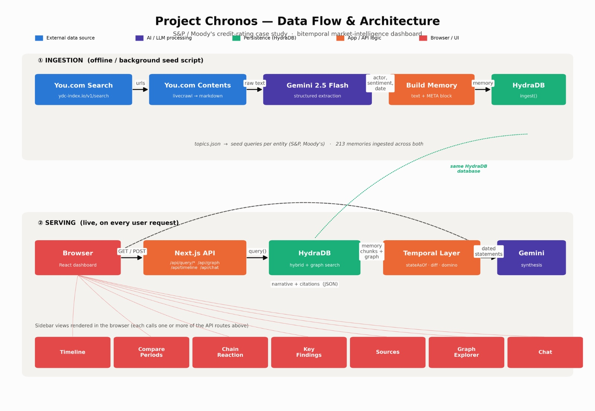

# Chronos (You.com + HydraDB)

- Demo video: https://youtu.be/Gl1oKczNmaE
- App: https://chronos-app-three.vercel.app
- GitHub: https://github.com/a-bhimava/Project-Chronos

An AI agent that captures market research into a persistent memory — building a knowledge base tailored to your company's needs, that stays and strengthens with every future use.



## Problem

Product, compliance, and BD teams in fast-moving industries need to track regulation and competitor moves constantly. Today this means manually monitoring scattered news and reports, and that research vanishes — the next person (or the same person, months later) starts from zero. Nothing compounds, and no one can quickly answer "are we behind, and why?"

## Competitive landscape

- **Codex Finance (OpenAI)** — automates modeling/QA via finance plugins, but is task-based and session-based with no shared memory linking regulation → competitor → product gap. Chronos persists findings into a shared graph that compounds across sessions and across the team.
- **Perplexity Finance** — real-time stock research for individual investors, one query at a time, no concept of the user's own product. Chronos maintains a self-node so every signal is checked against the company's actual capabilities.
- **Bloomberg Terminal** — the market's pricing/trading/news system, built for market participation, not product strategy. Chronos doesn't compete on market data — it fills the adjacent gap of linking regulatory/competitive events to product feature impact.
- **AlphaSense (closest competitor)** — Gartner-named leader in Competitive & Market Intelligence via AI document search, but still a search-deeper tool, not a remember-forever one, with no self-node and enterprise pricing. Chronos's graph retains relationships permanently and compares directly against the user's own product, scoped for individual product teams.
- **Hebbia** — enterprise document AI for deal teams, diligence-workflow focused, GenAI for investment banks/PE execution. Chronos is built for continuous regulation-to-competitor tracking for product/compliance/BD teams inside operating companies — a different buyer entirely.

**Summary:** every listed tool answers a question when asked. None of them remember the answer, connect it to the user's own product, and surface the same answer to the next person on the team — that gap is what Chronos closes.

## Tools used

- **You.com** — real-time, citation-backed web research (the "eyes")
- **HydraDB** — compounding relationship-graph memory (the "memory"); benchmarked against a flat/baseline store to demonstrate retrieval speed and relationship retention


## Solution

Chronos is an agent built from two parts:

- **Eyes (You.com)** — continuously reads live, citation-backed news, regulatory filings, and competitor announcements.
- **Memory (HydraDB)** — instead of storing facts as disconnected notes, builds a living relationship graph: this regulation affects this company, which competes with that company, which just shipped this feature. New facts append to the graph rather than overwriting it (git-like history), so the system gets smarter the longer it runs.
- **Self-node** — the user's own product capabilities are onboarded into the same graph, so every new regulation or competitor move is automatically checked against what the company actually has. Output isn't generic market news — it's "Competitor X just added this feature because of Regulation Y; you don't have it yet."

Because the graph is company-owned rather than tied to one user's session, any two people on the same team asking the same question get the same answer — a shared source of truth instead of siloed tribal knowledge.

## Who it's for

Product managers, compliance officers, and BD/partnerships teams inside operating companies (not traders — see competitive landscape below). Demoed on US financial services/payments (CFPB open banking rule, FedNow adoption, BNPL competitors) because the team has direct domain expertise to validate accuracy; the underlying engine (watch → connect → compound → compare) is industry-agnostic and swaps to healthcare, legal, or any other vertical by changing only the reading list.

## Enterprise use cases

- **Regulatory & compliance radar** — maps new mandates to the company's own tagged features, giving compliance, product, and engineering leads an identical, cited exposure report.
- **Competitor partnership & feature tracker** — keeps BD, product marketing, and product management working off one live graph, so a new hire inherits current context instead of a stale deck.
- **Pricing & fee benchmarking** — a shared, continuously updated view of competitor pricing so product, sales, and finance stop arguing over whose spreadsheet is right.
- **Merchant/partner outreach intelligence** — a shared graph of who's already served by whom, preventing duplicate BD outreach and surviving employee turnover.


## Getting started

```bash
npm install
```

Create `.env.local` in the repo root:

```bash
HYDRA_DB_API_KEY=...
HYDRA_DB_DATABASE=...
YOU_API_KEY=...
GOOGLE_GENERATIVE_AI_API_KEY=...
```

Seed the memory graph (topics and search queries live in `data/topics.json`), then run the app:

```bash
npm run seed
npm run dev
```

Run the temporal-engine unit tests with `npm run test`.

## Tracks

Track 1 (AI SaaS Startup — B2B Tools) and Track 4 (Vertical AI — Financial Services)

## Team
Aditya Teja Bhimavarapu
Himakar Yanamandra
Ashwin Swaminathan
Nikhil Mederametla

Carnegie Mellon University

## Links
